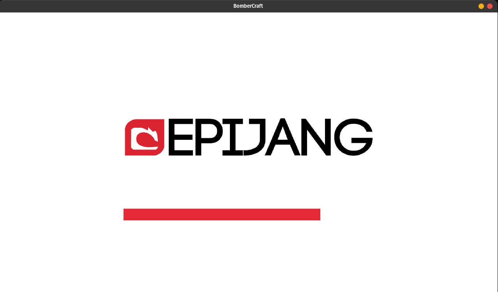
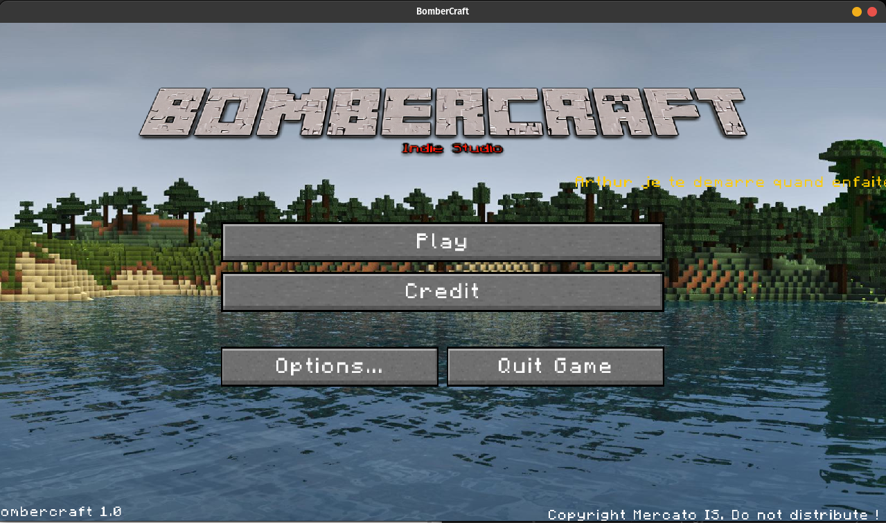
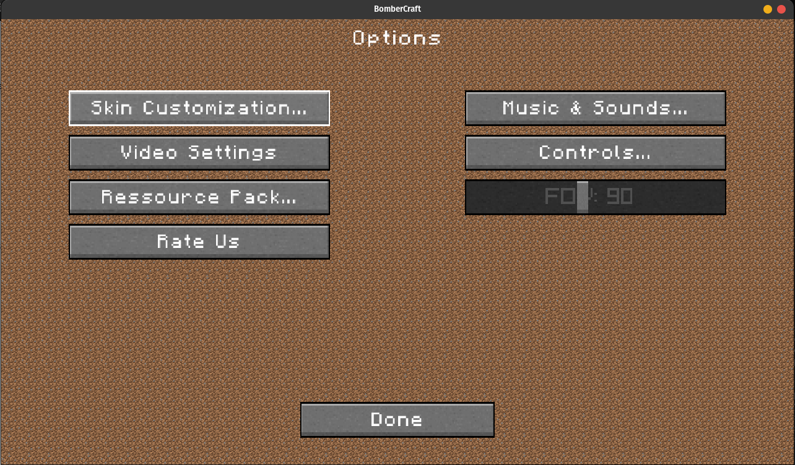
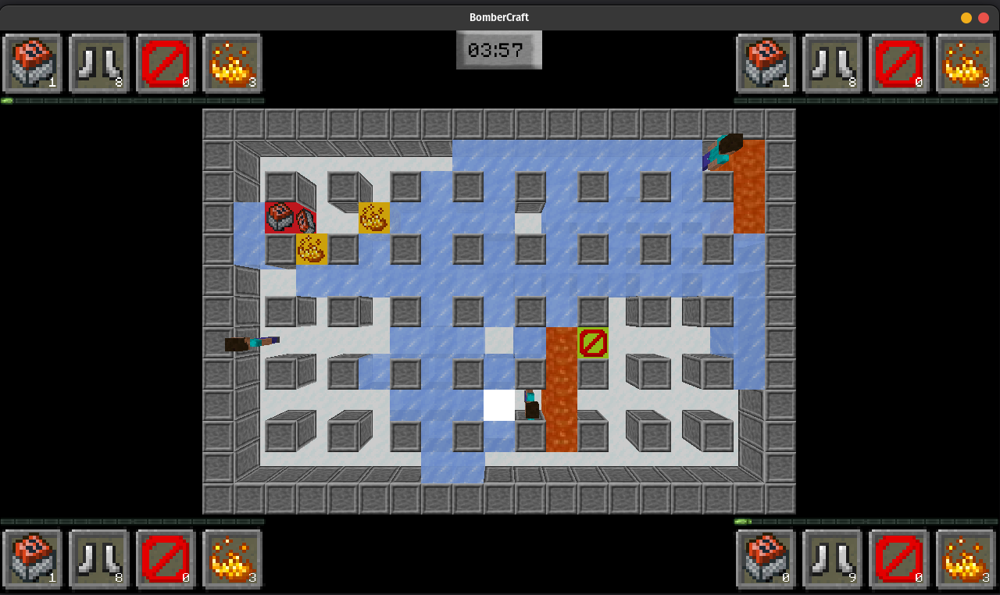
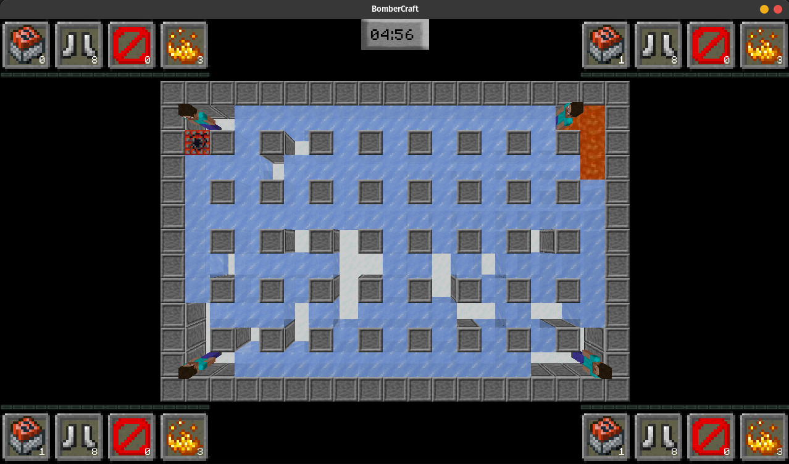

# Bombercraft
Bomberman with minecraft style - Epitech 2nd Year Project

* C++ multiplatform application (Mac, Windows, Linux).
* Local multiplayer
* Procedurally generated maps
* AI character

# Usage
Linux

   `mkdir build && cd build && cmake .. && make && cd .. && ./bomberman`

Windows

`cmake .. && cmake --build && ./bomberman.exe`

# Trailer

[Trailer](https://www.youtube.com/watch?v=nsOyamoZKTI)

